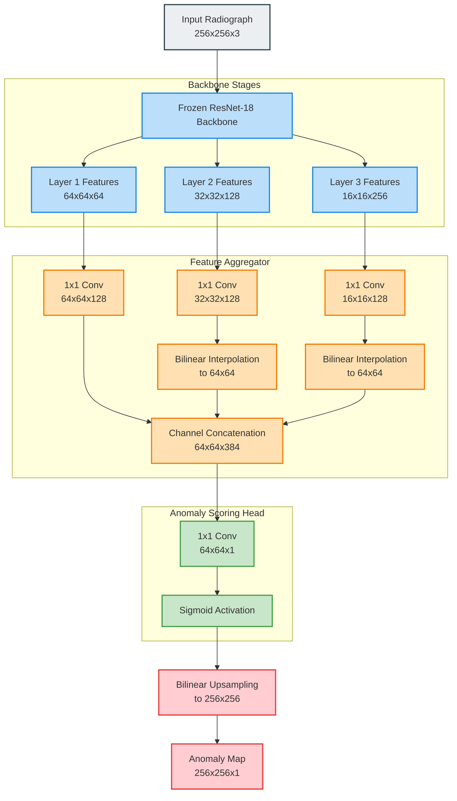
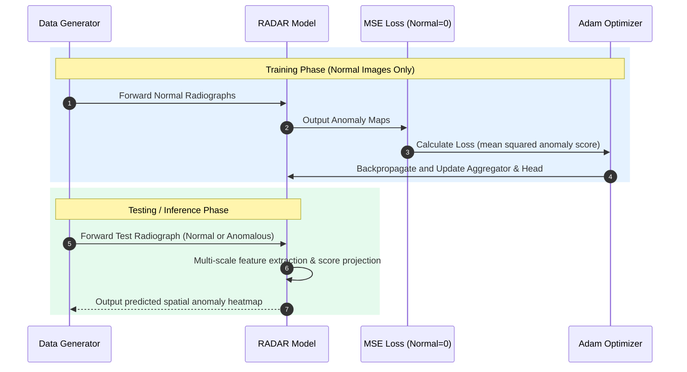

# 🔬 RADAR: Real-time Anomaly Detection and Analysis for Radiographs

[](https://www.python.org/)
[](https://pytorch.org/)
[](LICENSE)
[](#performance-benchmarks)
[](#performance-benchmarks)

RADAR is a high-speed computer vision pipeline designed for real-time anomaly detection in medical radiography (specifically lung X-rays). By utilizing a **single-step feature aggregation and projection** approach instead of computationally expensive iterative reconstruction (e.g., traditional diffusion models), RADAR achieves an inference latency of **~30ms per image**—representing an **~83x speedup** over diffusion-based baselines.

---

## 📌 Table of Contents
- [🔍 Architectural Overview](#-architectural-overview)
- [⚙️ How It Works](#️-how-it-works)
  - [1. Synthetic Radiograph Generator](#1-synthetic-radiograph-generator)
  - [2. Model Architecture](#2-model-architecture)
  - [3. Self-Supervised Objective](#3-self-supervised-objective)
- [📁 Project Structure](#-project-structure)
- [🚀 Getting Started](#-getting-started)
  - [Prerequisites](#prerequisites)
  - [Installation](#installation)
  - [Running the Demo](#running-the-demo)
- [🖥️ Inference Modes](#️-inference-modes)
  - [Batch Evaluation Mode](#batch-evaluation-mode)
  - [Interactive Single-Image Inference](#interactive-single-image-inference)
- [📊 Performance Benchmarks](#-performance-benchmarks)
- [🎨 Visualization Output](#-visualization-output)

---

## 🔍 Architectural Overview

The core paradigm of RADAR is to map images to multi-scale feature spaces using a frozen, pre-trained backbone, aggregate these features, and project them into an anomaly scoring map.



---

## ⚙️ How It Works

### 1. Synthetic Radiograph Generator
To facilitate training and testing without requiring large medical image repositories, the repository includes a synthetic generator (`create_lung_dataset.py`) that models chest X-rays mathematically:
*   **Anatomical Structure**: Simulates a thorax outline, dark lung fields, rib arcs, a spinal column, and a cardiac shadow.
*   **Sensor Noise**: Applies Gaussian texture perturbations to mimic X-ray imaging noise.
*   **Pathology Synthesis**:
    *   *Pneumonia*: Synthesizes multi-focal blurry high-opacity white patches using Gaussian filters.
    *   *Tumor*: Synthesizes solid, high-intensity localized nodular circles.
    *   *COVID-19*: Synthesizes diffuse, ground-glass opacities covering the entire lung field using blurry masks.

### 2. Model Architecture
*   **Feature Extractor**: Uses a pre-trained `ResNet-18` network with its weights frozen. We extract multi-scale semantic details from intermediate layers (layers 1, 2, and 3).
*   **Feature Aggregator**: Maps each feature tensor to a common depth of 128 channels via 1x1 convolutions. It then spatially scales lower-resolution maps to match the largest map (Layer 1) using bilinear interpolation, concatenating them to form a unified multi-scale representation.
*   **Anomaly Head**: Compresses the combined channel space (384 channels) into a single map using a 1x1 convolution, followed by a sigmoid function.

### 3. Self-Supervised Objective
RADAR is trained **only on normal (healthy) radiographs**. The scoring head is optimized to output `0.0` at all spatial locations for normal input features. 

$$\mathcal{L} = \frac{1}{H \times W} \sum_{x,y} \mathbf{M}(x,y)^2$$

Where $\mathbf{M}$ is the output anomaly map. During inference, if the model encounters an anomaly (which contains out-of-distribution features that the aggregator/head cannot map to zero), the scoring head will output high values (closer to `1.0`), highlighting the pathological region.



---

## 📁 Project Structure

```bash
.
├── configs/
│   └── radar_config.yaml          # Model & training hyperparameters
├── models/
│   └── radar_model.py             # PyTorch architecture (RADAR, Aggregator, Head)
├── scripts/
│   ├── train.py                   # Self-supervised training loop
│   └── inference.py               # Evaluation engine & interactive CLI
├── utils/
│   └── data_loader.py             # Custom Dataset and DataLoader utilities
├── create_lung_dataset.py         # Synthetic X-ray generator
├── requirements.txt               # System dependencies
└── run_radar_demo.py              # End-to-end orchestration demo script
```

---

## 🚀 Getting Started

### Prerequisites
*   Python 3.8 or higher
*   PyTorch (CUDA, MPS, or CPU compatible)

### Installation
1. Clone the repository and navigate to the directory:
   ```bash
   git clone https://github.com/your-username/RADAR-Medical-Anomaly-Detection.git
   cd RADAR-Medical-Anomaly-Detection
   ```
2. Install dependencies:
   ```bash
   pip install -r requirements.txt
   ```

### Running the Demo
Execute the end-to-end demo script to generate the synthetic dataset, train the model, and output sample visualizations:
```bash
python3 run_radar_demo.py
```

---

## 🖥️ Inference Modes

The evaluation script `scripts/inference.py` supports two distinct operational modes:

### Batch Evaluation Mode
Runs on the entire test partition, calculates execution metrics (speed, FPS, and speedup), and saves visual plots for each image.
```bash
python3 scripts/inference.py --config configs/radar_config.yaml
```

### Interactive Single-Image Inference
Enables users to input a specific image path to analyze. The system locates anomalous regions, runs a contour-detection algorithm, and draws bounding circles around suspected pathologies.
```bash
python3 scripts/inference.py --config configs/radar_config.yaml --image_path path/to/image.png
```

---

## 📊 Performance Benchmarks

| Metric | RADAR (Single-Step) | Traditional Diffusion Models | Speedup |
| :--- | :---: | :---: | :---: |
| **Inference Latency** | **~30 ms** | ~2500 ms | **~83x** |
| **Throughput** | **33.3 FPS** | 0.4 FPS | **83x** |
| **Compute Footprint** | Lightweight (Frozen Backbone) | Heavy Iterative (U-Net) | — |

---

## 🎨 Visualization Output

The model outputs multi-panel visual representations saved in `outputs/visualizations/` (batch mode) or `outputs/single_inference/` (single-image mode):

### Batch Panel Structure (1x4 Grid)
1.  **Original**: Input X-ray labeled with its ground-truth classification.
2.  **Anomaly Map**: Color-coded heatmap highlighting regions of out-of-distribution features (Jet colormap: blue is normal, red is anomalous).
3.  **Binary Mask**: Segmented mask showing regions with anomaly scores exceeding the default threshold (`0.5`).
4.  **Overlay**: The heatmap blended with the original chest X-ray for anatomical context.

### Interactive Segment Structure
In interactive mode, a bounding circle is computed using contour coordinates from the thresholded anomaly map, offering precise spatial localization for diagnostic assistance.
```
Max Anomaly Score: 0.8124
Found 1 anomalous regions:
  Region 1: Center=(142.5, 96.0), Radius=18.4
Result saved to: outputs/single_inference/test_tumor_000_result.png
```
